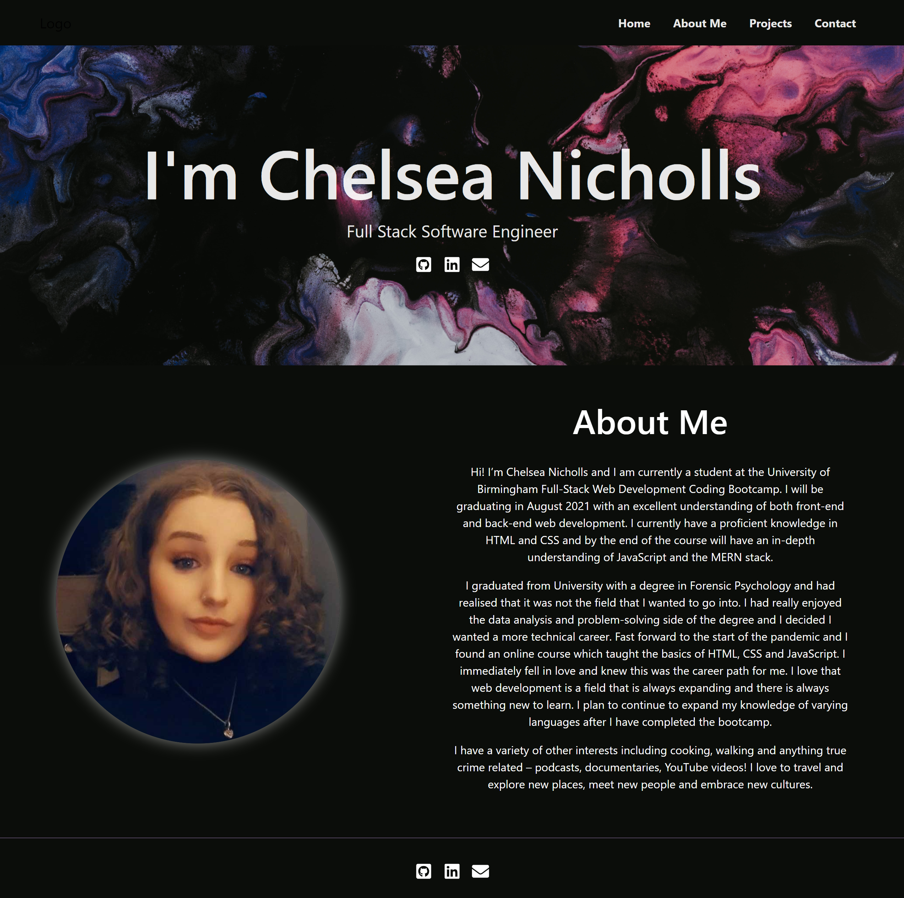

# Portfolio 

## Description

A react portfolio displaying a variety of front and back end projects that I have made.

## Table of Contents

[Description](#description)  
[Technologies Used](#technologies-used)  
[Getting Started](#getting-started)  
[Link to Deployed Application](#link-to-deployed-application)  
[Screenshots](#screenshots)
[License](#license)  
[Questions](#questions)

## Technologies Used

- React
- HTML5
- CSS

## Getting Started

```
git clone git@github.com:chelseanicholls95/react-portfolio.git
cd react-portfolio
code .

npm install
npm run start
```

## Link to Deployed Application

View the working application [here](https://chelseanicholls95.github.io/react-portfolio/).

## Screenshots





## License

This app is licensed by MIT.

## Questions

- Visit my [Github](https://github.com/chelseanicholls95)
- Email me at: chelseanicholls1995@outlook.com
